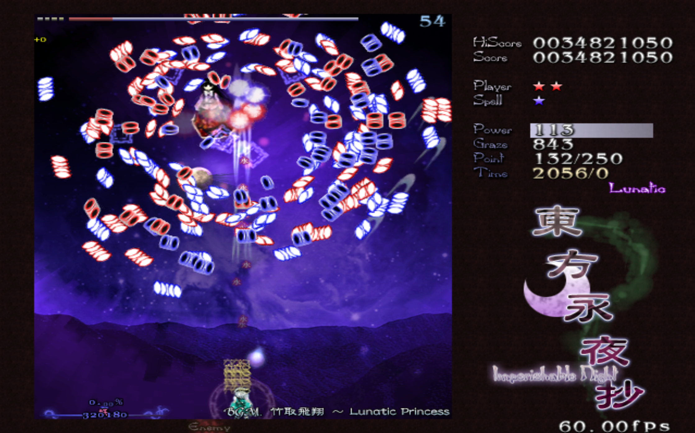

# Native 64-bit Linux port

TH08 now has a native-layout 64-bit Linux build alongside the original
fixed-layout i386 port. Both products compile the reconstructed authored game
sources and use the repository SDL2/OpenGL backend. Neither product executes
or bundles the original `th08.exe`.

Stable packages are available from the
[latest TH08 release](https://github.com/N0zoM1z0/th08/releases/latest).
Active development and CI snapshots remain on
[`port/portable-64bit`](https://github.com/N0zoM1z0/th08/tree/port/portable-64bit).
The default branch links here so users do not have to discover the port among
the repository's other development branches.

## Architecture status

| Architecture | Build verification | Runtime verification |
| --- | --- | --- |
| x86_64 | ELF64 little-endian PIE; native globals; no fixed-address TH08 symbols | Complete Sakuya/Remilia Lunatic route through Stages 1–6A, ending, results, and return to title under WSLg; additional Stage 4A and Stage 6B Practice validation; deterministic replay audits under Xvfb/Mesa |
| AArch64 | Cross-built ELF64 little-endian PIE with only AArch64 libraries | QEMU user-mode reaches DAT/version/logo/loading initialization; a real AArch64 desktop gameplay run remains required |

The x86_64 result is a playable 64-bit port, not merely a successful link. The
AArch64 artifact is build- and loader-verified, but emulated software OpenGL is
too slow to substitute honestly for a gameplay test on AArch64 hardware.

<p align="center">
  
</p>

The image above is from the product-ready x86_64 build in Stage 6B, with normal
life rules and no render-audit or automation patch. Maintainer bias, openly
declared: Kaguya is my favorite, and **竹取飛翔 ～ Lunatic Princess** is
my favorite track. XD

## Runtime data

Supply a legally obtained original Japanese TH08 data directory containing:

- `th08.dat`
- `thbgm.dat`

Start a packaged build with:

```bash
./run-th08.sh "/path/to/original/TH08 directory"
```

On Debian/Ubuntu x86_64, packaged runtime dependencies are:

```bash
sudo apt-get install \
  libstdc++6 libgl1 libfontconfig1 \
  libsdl2-2.0-0 libsdl2-image-2.0-0 libsdl2-ttf-2.0-0 \
  fonts-vlgothic
```

Install the corresponding native packages on an AArch64 distribution.

The selected directory must be writable. TH08 creates configuration, score,
backup, replay, screenshot, and diagnostic files there. The port does not need
the original executable at runtime.

## Build

On an x86_64 Debian/Ubuntu host, install the native development libraries:

```bash
sudo apt-get install \
  g++ cmake ninja-build pkg-config \
  libsdl2-dev libsdl2-image-dev libsdl2-ttf-dev \
  libfontconfig1-dev libgl-dev
```

Then build and verify x86_64:

```bash
git switch port/portable-64bit
scripts/build-portable-linux.sh x86_64
```

For an AArch64 cross-build on the same host:

```bash
sudo dpkg --add-architecture arm64
sudo apt-get update
sudo apt-get install \
  g++-aarch64-linux-gnu \
  libsdl2-dev:arm64 libsdl2-image-dev:arm64 libsdl2-ttf-dev:arm64 \
  libfontconfig1-dev:arm64 libgl-dev:arm64
scripts/build-portable-linux.sh aarch64
```

On a native AArch64 host, the same command uses the host compiler rather than
the cross toolchain. Outputs are:

- `build/portable-linux-x86_64/th08-modern`
- `build/portable-linux-aarch64/th08-modern`

Create redistributable source-built archives with:

```bash
scripts/package-portable-linux.sh \
  build/portable-linux-x86_64/th08-modern x86_64
scripts/package-portable-linux.sh \
  build/portable-linux-aarch64/th08-modern aarch64
```

## Verification

Static verification rejects the old fixed-address i386 ownership model and
checks the requested ELF machine:

```bash
scripts/verify-portable-linux.sh \
  build/portable-linux-x86_64/th08-modern x86_64
scripts/verify-portable-linux.sh \
  build/portable-linux-aarch64/th08-modern aarch64
```

On a graphical x86_64 host, the isolated gameplay smoke test uses symlinks to
the two original archives, writes everything else below `build/`, and requires
the game to progress from the title screen into the bundled Stage 5 demo:

```bash
scripts/smoke-test-portable-linux.sh \
  build/portable-linux-x86_64/th08-modern \
  "/path/to/original/TH08 directory" 40
```

The check fails on an early exit, `modern-crash.txt`, or failure to request the
title, replay, SHT, STD, ECL, and message resources used by that route.

### Deterministic replay render audit

For regressions that are difficult to recognize from a crash log, the native
Linux build has an opt-in enemy-render oracle. It starts a selected stage from
a user-supplied replay, samples the selected ANM texture region, brackets the
actual draw with framebuffer reads, and records the VM geometry, color state,
draw result, and pixel delta. The audit is off during normal play.

```bash
scripts/audit-render-replay-linux.sh \
  build/portable-linux-x86_64/th08-modern \
  "/path/to/original/TH08 directory" \
  "/path/to/th8_01.rpy" \
  3 180
```

The stage index is zero-based (`3` is Stage 4); the final argument is the audit
window in seconds. The script runs in an isolated Xvfb/llvmpipe directory,
advances replay frames faster than wall clock, and writes the last report to
`build/render-audit-last.csv`. It fails on missing or empty sprite data,
invalid geometry, a crash, or a repeatedly queued draw that never changes the
framebuffer. Low-intensity ANM color modulation is included in the expected
texture statistics so scripted fades are not mistaken for missing art. The
audit launcher applies its endurance patch externally through GDB; set
`TH08_RENDER_AUDIT_KEEP_LIVES=0` to audit with normal life rules. Neither mode
modifies the executable or the behavior of a packaged build.

This is deliberately a semantic and pixel oracle, not image recognition. It
currently covers primary enemy and boss VMs; backgrounds, bullets, secondary
VMs, and subjective visual parity still need a real graphical run.
The [render-audit guide](RENDER_AUDIT.md) defines the versioned CSV contract,
acceptance policy, cross-port comparator, and adapter boundary for future
platform backends.

## Why a separate native layout exists

The exact reconstruction remains a 32-bit VC7 product. The i386 Linux port also
uses 32-bit pointers and a linker script that preserves target virtual
addresses. A 64-bit PIE cannot safely inherit either assumption.

The 64-bit build therefore defines `TH08_PORTABLE_NATIVE_LAYOUT` and keeps two
kinds of structure distinct:

- serialized files retain their original 32-bit offsets and exact byte sizes;
- live runtime objects use native pointers and native alignment.

Loaders now resolve, without truncation, the pointer-like fields in stage
background (`.std`), ECL, player shot (`.sht`), message, and replay data. Replay
save/load keeps the version-6 wire format compatible while maintaining a
native pointer table outside the serialized `0x134`-byte record.

The same separation now covers `score.dat`. Its original `0x1c`-byte wire
header remains fixed while the live native score-list pointer is stored after
that header. Existing retail/i386 saves therefore load without being rejected
or silently recreated, and Practice unlock masks survive a 64-bit load/save
round trip.

Three target symbols were alternate names for bytes inside other objects. The
fixed i386 linker script supplied that identity automatically. Native layout
expresses the same ownership in C++: ECL time-scale flags are the Supervisor
flag word, the spell background ANM is the EffectManager field, and the two GUI
screen-effect counters share storage.

Native object clears must follow the live native layout as well. In particular,
`EnemyManager::Initialize` uses `sizeof` for its manager and spawn-template
clears in a native-layout build. Keeping the original 32-bit byte constants in
an ELF64 process left the expanded tail—including timeline state—uncleared and
could stall later stage transitions. The VC7 and fixed-layout paths retain the
target-observed constants.

Compiler stack layout is not a portable aggregate representation. The exact
`EnemyManager::OnDrawImpl` source preserves VC7's adjacent `savedScaleX` and
`savedScaleY` locals, but modern builds save the pair in a real `Float2`.
Treating `&savedScaleX` as an eight-byte vector happened to work on VC7/i386;
on x86_64 GCC, a boss trail restored an unrelated stack value as `scale.y`,
making the boss geometry NaN and invisible. The replay oracle caught the first
bad frame and verified the bounded modern-only correction.

Earlier Linux bring-up runs also exposed missing enemy/boss sprites, incomplete
effects, Stage 4-to-5 dynamic-text tiling, and later-stage transition stalls.
The final x86_64 full-route and Practice passes did not reproduce those issues
after the native-layout and render fixes. This is broad runtime evidence rather
than a promise that every GPU/driver combination is identical; regressions
should still include the runtime diagnostics described in `PLAY_LINUX.md`.

The VC7 build and comparison path never defines the native-layout macro. These
port changes do not claim new exact matches and must continue to pass the
repository's target-pinned comparison checks independently.
