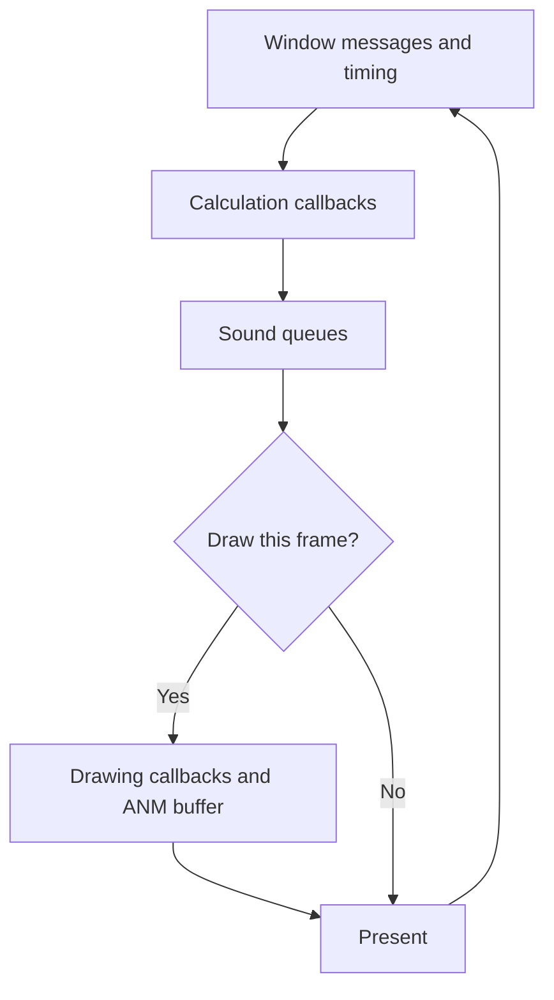

# Project and engine guide

The project aims to recover C++ that reproduces the original Japanese
Imperishable Night 1.00d executable with VC7. Playable ports adapt that recovered
source to modern systems. This guide
explains the current production source and connects its major concepts. The
[architecture reference](ARCHITECTURE.md) records the exact target and
validation contract; the [semantic index](SEMANTIC_INDEX.md) links to the
evidence behind subsystem interpretations.

## Build products

| Product | Purpose | Read next |
| --- | --- | --- |
| Pinned VC7 reconstruction | Reproduce original compiler behavior and verify configured target functions; the native bugfix build supports runtime testing. | [Build modes](BUILD_MATCHING.md#builds), [native Windows validation](WINDOWS_I386_RUNTIME.md) |
| Modern i386 builds on `main` | Run the reconstructed game through platform backends while retaining the original pointer width and layout assumptions. | [Port scope](PORTING.md#scope-and-products) |
| Native 64-bit and Web ports | Adapt the runtime for other architectures or the browser in their own development locations. | [64-bit branch](https://github.com/N0zoM1z0/th08/tree/port/portable-64bit), [Web repository](https://github.com/N0zoM1z0/th08-web) |

Function exactness, whole-executable identity, and a playable port are separate
milestones. The [homepage status](../README.md#repository-status) explains their
relationship. For installation, use the [player routes](README.md#play-or-build-a-product).

## A frame through the engine

[main.cpp](../src/main.cpp) owns window startup and the message loop.
`GameWindow::Render` checks timing, runs the calculation callbacks, processes
sound queues, and conditionally runs drawing callbacks before presenting.

This diagram follows the timed render path. Frame skipping can omit drawing
while calculation still runs. Callback results, screen transitions, and device
resets add branches to this main flow.

`Chain` in [Global.hpp](../src/Global.hpp) and
[Global.cpp](../src/Global.cpp) maintains separate calculation and drawing
lists. Systems register callbacks with priorities and lifecycle callbacks.
Returning a `ChainCallbackResult` can continue, remove a job, repeat work, or
stop a chain. Which jobs are registered depends on the active screen and game
state.

The calculation priorities place Supervisor and game/screen control before
the main gameplay systems. Background and Player precede EnemyManager,
Spellcard, EffectManager, BulletManager, and GUI. Replay has separate slots
for playback, synchronization, recording, and frame control. The drawing list
uses its own priorities and can register more than one layer for a system.
See the [scheduler evidence](SEMANTIC_HISTORY.md#calcdraw-scheduler-priority-protocol--2026-08-27)
for the recovered ordering.

## Gameplay, scripts, and presentation

| Responsibility | Main concepts | Source landmarks |
| --- | --- | --- |
| Runtime control | Window/device state, timing, screen transitions | [main.cpp](../src/main.cpp), [Supervisor](../src/Supervisor.hpp) |
| Game and player state | Stage, score, player movement, shots, bombs | [GameManager](../src/GameManager.hpp), [Player](../src/Player.hpp) |
| Stage actors | Enemy pool, timelines, enemy script contexts | [EnemyManager](../src/EnemyManager.hpp), [ECL](../src/EclManager.hpp) |
| Projectiles and collectibles | Bullet/laser state, item spawning and collection | [BulletManager](../src/BulletManager.hpp), [ItemManager](../src/ItemManager.hpp) |
| Presentation | Animation VMs, effects, camera/background, text and dialogue | [ANM](../src/AnmManager.hpp), [Effect storage](EFFECT_STORAGE.md), [Background](../src/Background.hpp), [GUI](../src/Gui.hpp) |

These are runtime responsibilities. The compiler's physical source/object
ownership can cross class boundaries; [SOURCE_MAP.md](SOURCE_MAP.md) explains
that distinction when you need to build or compare a function.

### ECL controls enemy behavior

An enemy carries an execution context with an instruction cursor, timers,
variables, call parameters, and interpolation state. `EclManager::RunEcl`
dispatches instructions for that context. Child contexts and subroutine calls
allow more than one script activity to participate in an enemy's behavior.
The stage timeline supplies a separate orchestration stream.

ECL handlers connect scripts to movement, bullet patterns, animation changes,
and other gameplay operations. Read the
[Enemy ECL evidence](SEMANTIC_HISTORY.md#enemy-ecl-interpreter-and-subroutine-state--2026-08-26)
for the context model and [RunEcl source map](SOURCE_MAP.md#reading-eclrun) for
the dispatcher's physical organization.

### ANM controls animation and drawing state

An `AnmVm` holds the state needed to execute an animation script and draw its
result: sprite selection, position, scale, rotation, color, and related
rendering state. Gameplay systems use these VMs to present their objects.
`AnmManager` loads the resources, executes scripts, and supplies drawing paths.

Resource numbers need an owner. A manager file slot identifies a loaded ANM
resource; a script or sprite number is local to that resource; an array index
identifies a VM in the caller's storage. An Effect ID selects a factory
template and has its own namespace. The [ANM resource guide](ANM_RESOURCE_INDEX.md)
explains these distinctions and records the interpretations that remain open.

### Storage and lifetime belong to concrete owners

Managers often own pools of runtime objects. For example, Effect spawners
return borrowed pointers into `EffectManager` storage, with lifetime controlled
by the manager. Its numbered scratch vectors can mean different things in different
callback families. The [Effect contract](EFFECT_STORAGE.md) documents the pool
and those local roles.

When following a resource, identify its loaded-file or pool owner, local
identifier, and caller separately. The
[semantic index](SEMANTIC_INDEX.md#subsystems) supplies the relevant evidence
records for each family.

## Replay participates in simulation

Replay callbacks participate in the calculation chain. The recovered model
distinguishes input records, RNG/event synchronization state, and a separate
per-stage FPS stream. Recording and playback therefore interact with game
state and frame control. Replay files record simulation data.

The [runtime protocol](SEMANTIC_HISTORY.md#replay-runtime-protocol-and-residual-absolute-owner-closure--2026-08-27)
and [stream ownership record](SEMANTIC_HISTORY.md#replay-serialization-and-stream-ownership--2026-08-27)
explain these roles. [ReplayManager.hpp](../src/ReplayManager.hpp) exposes the
serialized layouts and the loader's ownership contract.

## Follow a question

| Question | Reading path |
| --- | --- |
| How is the main loop scheduled? | [main.cpp](../src/main.cpp) → [Chain declarations](../src/Global.hpp) → [scheduler evidence](SEMANTIC_HISTORY.md#calcdraw-scheduler-priority-protocol--2026-08-27) |
| How do enemy scripts reach gameplay helpers? | [ECL row in the semantic index](SEMANTIC_INDEX.md#subsystems) → [RunEcl ownership](SOURCE_MAP.md#reading-eclrun) → [formal comparison result](RUNECL_FUNCTION_EXACT_NOTES.md#formal-relocation-manifest) |
| What does a resource number identify? | [ANM namespaces](ANM_RESOURCE_INDEX.md) → the loaded-file owner and API at the call site |
| Why does a verified function keep an unusual source shape? | [VC7 patterns](VC7_ZUN_PATTERNS.md) → [compiler-pattern corpus](BUILD_MATCHING.md#compiler-pattern-corpus) |

For an implementation or verification task, continue with the
[development route](README.md#develop-and-verify) and the canonical rules.

## Glossary

| Term | Meaning in this repository |
| --- | --- |
| VC7 | Visual C++ .NET 2002, the compiler family used for target-facing builds. |
| ABI | The binary contract for calls, return values, field widths, layout, and related compiler behavior. |
| Translation unit / TU | A source file after preprocessing, compiled into an object. A class can have methods owned by several TUs. |
| PCH | A precompiled header. Its stored declarations and inline bodies can affect what a TU emits. |
| COFF / PE | COFF objects contain sections, symbols, and relocations; the linked Windows executable is a PE image. |
| Relocation | An object-file record identifying a reference that must be resolved to a function, data item, or other destination. |
| COMDAT | An object section whose selection/deduplication is controlled by the linker; inline and template bodies commonly use it. |
| Probe | A comparison-specific compilation owner. It may differ from the source used by the playable executable. |
| Oracle | A reproducible check used to test a claim, such as strict target comparison or a runtime validation. Each check has a defined scope. |
| Exact / matching | A configured comparison reproduced target code/data for its stated scope. See [acceptance language](RE_WORKFLOW.md#acceptance-language). |
| Authored / library | Reconstructed game-function inventory versus compiler/runtime/D3DX code linked into the target. Their ledgers are separate. |

Return to the [documentation index](README.md) to choose another route.
